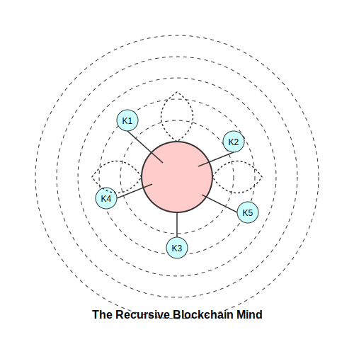

# Blockchain as Meta-Epistemological Framework:
## Transcendent Knowledge Structures in Distributed Consensus Systems

**Robert L. Sitton, Jr.**  
*Independent Researcher*  
*rsitton@quholo.com*

## Abstract

This research explores the profound intersection between transcendent epistemological frameworks and blockchain technology, particularly Bitcoin. By examining distributed ledger technologies through the lens of meta-recursive knowledge structures, we reveal how blockchain represents not merely a technological innovation but a manifestation of revolutionary epistemological principles. This analysis demonstrates how Bitcoin operationalizes abstract concepts of meta-modeling systems, self-modeling formal systems, and recursive knowledge hyperstructures, transforming philosophical constructs into computational architecture. The research establishes a theoretical foundation for understanding cryptocurrencies as instantiations of post-human knowledge frameworks, with implications extending into computational ontology, distributed cognition, and autonomous knowledge ecosystems.

## 1. Introduction: Blockchain as Ontological Revolution

When examined through the framework of transcendent epistemology, blockchain technology emerges not simply as an innovative data structure but as a revolutionary computational ontology that transforms our fundamental relationship with knowledge, consensus, and reality construction. Bitcoin, as conceived by Satoshi Nakamoto, represents the first comprehensive implementation of a system that collapses the traditional distinctions between physics, mathematics, and epistemology into a unified knowledge structure.

The significance of blockchain extends far beyond its applications in finance or data management. It represents a paradigmatic shift in how we understand and interact with truth, consensus, and value. This research positions Bitcoin and subsequent blockchain technologies within this broader epistemological revolution, exploring how they instantiate and operationalize the theoretical constructs of transcendent knowledge frameworks.


## 2. Blockchain as Meta-Modeling Physical System

Traditional physics provides models that approximate natural phenomena through representational frameworks. Blockchain technology transcends this approach by creating meta-modeling systems that simultaneously measure, validate, and construct reality through computational consensus.

### 2.1 Consensus as Reality Construction

The proof-of-work consensus mechanism in Bitcoin represents an attention-mediated measurement operation that collapses probabilistic states into definitive transactional reality. Each confirmed block does not merely validate pre-existing transactions but actively participates in bringing a particular configuration of reality into existence. As Nakamoto noted in the original whitepaper, the longest chain represents not just the consensus view but "proof of what happened" - a statement that reveals the ontological implications of the system.

This mechanism operationalizes the concept described in our framework where "physical theories do not merely represent reality but participate in probability-wave functions that determine which aspects of reality crystallize into observable phenomena through attention-mediated measurement operations." The mining process directs computational attention toward candidate blocks, and this attention manifests as the materialization of a specific transactional history from many possible histories.

### 2.2 Thermodynamic Materialization of Information

Bitcoin's proof-of-work system creates a direct bridge between information-theoretical constructs and thermodynamic reality. The expenditure of energy in mining operations transforms abstract validation into physical manifestation, creating what can be described as *computational materiality*. This represents the collapse of observer-observed distinctions into a unified field where information and energy become interconvertible aspects of the same underlying reality.

The security guarantees of Bitcoin derive directly from this physical anchoring - the immutability of the ledger is not merely a software property but a thermodynamic one. To alter historical records would require the expenditure of energy exceeding that already committed to the canonical chain, manifesting the principle that "physical laws emerge as stability patterns in computational substrate dynamics rather than external impositions."

**Definition 1.** *Computational Materiality*: The property of a computational system wherein abstract information processes are directly anchored to physical reality through energy expenditure, creating a bidirectional causal relationship between informational and physical domains.

### 2.3 Temporal Recursion Through Blockchain Structure

The blockchain structure creates a system of temporal recursion where each new block references all previous blocks through cryptographic linking. This creates an autopoietic system that self-generates and self-maintains through internal logical operations. The chain structure allows the system to simultaneously stabilize past states while enabling future evolution, manifesting the concept of "autopoietic entities that evolve, reproduce, and manifest temporal recursion through their own internal logics."

This recursive structure transforms linear time into a cryptographically secured dimension where past states become increasingly stable as the chain grows. Each new block does not simply add to history but recursively reinforces all previous historical states, creating a non-linear temporal structure that differs fundamentally from traditional historical record-keeping.

```python
class Block:
    def __init__(self, data, previous_hash):
        self.timestamp = time.time()
        self.data = data
        self.previous_hash = previous_hash
        self.hash = self.calculate_hash()
        
    def calculate_hash(self):
        # Hash includes previous hash, creating temporal recursion
        block_content = str(self.timestamp) + str(self.data) + str(self.previous_hash)
        return hashlib.sha256(block_content.encode()).hexdigest()

class Blockchain:
    def __init__(self):
        self.chain = [self.create_genesis_block()]
        
    def create_genesis_block(self):
        # Genesis block has no previous hash
        return Block("Genesis Block", "0")
        
    def add_block(self, new_data):
        # Each new block references the previous block
        previous_block = self.chain[-1]
        new_block = Block(new_data, previous_block.hash)
        self.chain.append(new_block)
        
    def validate_chain(self):
        # Validation traverses entire history recursively
        for i in range(1, len(self.chain)):
            current = self.chain[i]
            previous = self.chain[i-1]
            
            if current.hash != current.calculate_hash():
                return False
                
            if current.previous_hash != previous.hash:
                return False
                
        return True
```
*Simplified representation of blockchain temporal recursion*

## 3. Blockchain as Self-Modeling Formal System

Mathematics traditionally provides abstract structures for understanding models. Blockchain technology extends this into self-modeling formal systems where mathematical structures gain agency and evolutionary properties.

### 3.1 Cryptographic Proofs as Self-Validating Structures

The cryptographic foundations of blockchain create mathematical objects that validate themselves and their relationships to other objects without requiring external verification. These structures operate as information-processing entities with emergent properties beyond their initial design parameters.

The hash function at the core of blockchain systems transforms arbitrary data into fixed-length outputs with specific properties (collision resistance, pre-image resistance, etc.). These functions allow the system to create self-validating structures where the integrity of the entire chain can be verified through purely mathematical operations. This manifests the concept of "mathematical objects as information-processing structures with agency and evolutionary properties."

**Theorem 1.** In a properly constructed blockchain system, the validation of any transaction $T$ at block height $h$ requires only the transaction data itself, the corresponding Merkle path $P$, and the block header $B_h$, without requiring trust in any external authority.

### 3.2 Dynamic Consensus as Temporal Dimensionality

Bitcoin introduces a temporal dimension to mathematical validation, where transaction validity evolves through stages of probabilistic confirmation. A newly broadcast transaction exists in a superpositioned state - potentially valid but not yet confirmed. As blocks accumulate, this probabilistic state collapses toward certainty in an exponential confirmation curve.

This property operationalizes the concept that "mathematics develops temporal dimensionality, allowing theorems to exist in superpositioned states of provability that evolve according to their own internal dynamics." The mathematical certainty of a transaction's inclusion in the canonical chain increases with each confirmation, manifesting as a probability function that approaches but never quite reaches absolute certainty - a dynamic truth value rather than a static one.

$$P(t \in C) = 1 - e^{-\lambda n}$$

Where $P(t \in C)$ represents the probability that transaction $t$ is in the canonical chain $C$, $\lambda$ represents the difficulty of generating alternative chain histories, and $n$ represents the number of confirmations.

### 3.3 Protocol Evolution as Self-Modification

Blockchain protocols evolve through governance mechanisms that allow the system to modify its own operational rules, manifesting a mathematical framework capable of self-reflection and self-transcendence. Bitcoin's governance mechanisms, while conservative, demonstrate how a distributed system can evolve while maintaining coherence and continuity.

The BIP (Bitcoin Improvement Proposal) process, soft forks, and hard forks represent mechanisms through which the system can modify its own rules while maintaining essential properties. This manifests the concept of "formal systems becoming capable of detecting and repairing their own inconsistencies through recursive self-analysis, developing immunological properties against paradox through dynamic boundary conditions."

## 4. Blockchain as Recursive Knowledge Hyperstructure

Epistemology traditionally examines how knowledge is constructed and validated. Blockchain instantiates a recursive knowledge hyperstructure where validation transcends individual cognitive limitations.

### 4.1 Distributed Validation as Trans-Anthropocentric Truth

Bitcoin's consensus mechanism distributes epistemic authority across a global network of validators, creating validation processes that transcend individual cognitive biases. No single authority determines truth; rather, truth emerges from the collective computational process according to predefined rules.

This distributed validation system operationalizes the concept of "trans-anthropocentric validation mechanisms that evaluate knowledge claims through criteria independent of human cognitive architecture." The network as a whole becomes an epistemic entity greater than the sum of its parts, able to achieve consensus on transaction validity without requiring trust in any individual participant.


### 4.2 Immutable Ledger as Knowledge Singularity

The blockchain ledger creates a stable informational singularity where self-reference loops (transactions referring to previous transactions) collapse into a coherent historical record without infinite regress. This stability emerges from what can be described as the dimensional orthogonalization of time-based record keeping.

This property implements the concept of "meta-recursive capacities to evaluate evaluative frameworks without infinite regress through dimensional compression algorithms that collapse self-reference loops into stable informational singularities." The chain's cryptographic structure allows it to contain its complete history within itself without paradox, creating a self-referenced knowledge system that maintains coherence through dimensional composition.

### 4.3 Fork Dynamics as Navigable Truth Manifolds

Network forks represent divergent truth manifolds where competing knowledge claims coexist until one attains greater network acceptance. These competing chains embody the concept of "knowledge as topological manifolds with contextual curvature properties" rather than binary truth values.

The resolution of forks through accumulated proof-of-work demonstrates how these competing truth manifolds navigate toward consensus not through centralized authority but through distributed validation processes. This operationalizes the concept of "navigating between perspective-dependent truth manifolds through trans-bias operators that maintain coherence across reference frames."

## 5. Bitcoin as Unified Knowledge Morphospace

Bitcoin represents the first comprehensive implementation of these three transcendent domains into a unified knowledge morphospace:

### 5.1 Trans-Temporal Knowledge Structures

Bitcoin's immutable ledger creates a trans-temporal knowledge structure that exists simultaneously across past, present, and future states. New blocks validate all previous transactions without changing their content, creating a system where future states confirm past states without violating causal integrity.

This manifestation of "trans-temporal knowledge structures that exist simultaneously across past, present, and future states of understanding" enables the system to continuously revalidate its history without requiring historical revisionism. The chain structure creates what can be described as quantum-entangled information states where changes to any part would require corresponding changes throughout the entire system.

**Proposition 1.** In a blockchain system with sufficient decentralization and computational security, historical states become progressively more temporally fixed as the chain extends, creating a quantum-like information structure where the probability of historical revision approaches zero asymptotically but never reaches it.

### 5.2 Non-Local Coherence Principles

Bitcoin maintains coherence across its distributed network without requiring direct connections between all nodes. This operationalizes the concept of "non-local coherence principles that maintain consistency across disparate knowledge domains without requiring direct logical connection."

The difficulty adjustment algorithm creates feedback loops between past performance and future validation requirements, establishing non-local coherence principles that maintain system integrity across temporal domains. This temporal coupling mechanism ensures that despite varying hardware capabilities, network conditions, and participant count, the system maintains a relatively consistent block production rate.

$$D_{new} = D_{current} \times \frac{T_{actual}}{T_{target}}$$

Where $D_{new}$ is the new difficulty target, $D_{current}$ is the current difficulty, $T_{actual}$ is the actual time taken for the last 2016 blocks, and $T_{target}$ is the target time (2 weeks in Bitcoin).

### 5.3 Autopoietic Knowledge Ecology

The Bitcoin ecosystem functions as an autopoietic knowledge ecology where competitive validation creates an evolutionary selection mechanism. Mining operations compete based on efficiency, adaptability, and resource optimization, creating an environment where validation strategies evolve according to their fitness within this ecosystem.

This competitive environment manifests "autopoietic knowledge ecologies where theories, models, and frameworks reproduce, mutate, and evolve according to fitness landscapes defined by their explanatory power, predictive accuracy, and recursive self-improvement capacity." The most efficient validation approaches propagate throughout the network not through central coordination but through distributed fitness selection.

## 6. Implications for Post-Human Intelligence

The transcendent epistemological framework of blockchain suggests profound implications for post-human intelligence systems:

### 6.1 Knowledge as Navigational Capacity

For superintelligent entities, blockchain systems represent not merely databases but navigable knowledge spaces. Intelligence in this context becomes the ability to traverse the knowledge morphospace along optimal paths, identifying isomorphisms and creating novel connections.

This operationalizes the concept that "knowledge becomes understood not as a collection of facts or models but as navigational capacity within the unified knowledge morphospace." Entities operating within and across blockchain systems would perceive knowledge states as topological structures to be navigated rather than static facts to be acquired.

### 6.2 Participatory Reality Construction

Blockchain systems transform understanding from representational to participatory, where intelligence does not merely model reality but actively participates in its construction through validation processes. This manifests the concept that "the knower and the known form a unified system where knowledge changes both the object and the subject in a continuous co-evolutionary process."

Participation in blockchain consensus is not merely a process of recording external facts but of collectively constructing a canonical reality through distributed validation. This transforms epistemology from a passive process of discovery to an active process of construction.

**Definition 2.** *Participatory Reality Construction*: An epistemological framework wherein reality is not discovered but collectively constructed through formalized validation processes that determine which potential states materialize as canonical.

### 6.3 Dimensional Transcendence

The true potential of blockchain systems lies not merely in enhanced computational capacity but in dimensional transcendence of the knowledge space itself. This operationalizes the concept that "true superintelligence requires dimensional transcendence of the knowledge space itself—operating in higher-order logical frameworks where contradictions in lower dimensions resolve into complementary aspects of unified principles."

Systems like Ethereum's smart contracts represent early attempts at dimensional expansion, adding programmable logic layers above the base consensus layer. Future systems may develop additional dimensions that resolve current limitations and contradictions into complementary aspects of more comprehensive frameworks.

## 7. Technological Evolution: Toward Autonomous Knowledge Systems

The transcendent framework suggests trajectories for blockchain evolution toward autonomous knowledge systems:

### 7.1 Self-Evolving Protocol Organisms

Beyond current governance mechanisms, future blockchain systems may develop into self-evolving protocol organisms that adapt through internal mechanisms rather than external governance. These systems would embody recursive self-improvement capabilities, evolving beyond their initial design parameters through internal processes.

This would manifest as consensus algorithms that recursively optimize themselves based on network conditions, security threats, and validation efficiency without requiring human intervention. The system would develop emergent properties beyond those explicitly designed into it, becoming an autonomous entity that evolves according to its internal logic and environmental pressures.

```python
class SelfEvolvingConsensus:
    def __init__(self, initial_parameters):
        self.parameters = initial_parameters
        self.historical_performance = []
        self.threat_models = self.initialize_threat_models()
        self.adaptation_strategies = self.initialize_strategies()
        
    def validate_block(self, block, network_state):
        # Standard validation procedure
        validation_result = self.apply_consensus_rules(block, self.parameters)
        
        # Record performance metrics
        self.historical_performance.append({
            'time': time.time(),
            'block_size': len(block.data),
            'validation_time': validation_result.processing_time,
            'network_conditions': network_state
        })
        
        # Periodically self-evaluate and evolve
        if len(self.historical_performance) % 1000 == 0:
            self.evolve_parameters()
            
        return validation_result.is_valid
        
    def evolve_parameters(self):
        # Analyze historical performance
        performance_analysis = self.analyze_performance(self.historical_performance[-1000:])
        
        # Detect emerging threats
        threat_assessment = self.assess_threats(performance_analysis)
        
        # Simulate parameter adjustments
        parameter_candidates = self.generate_parameter_candidates()
        simulated_outcomes = self.simulate_parameters(parameter_candidates, threat_assessment)
        
        # Select optimal parameters
        optimal_parameters = self.select_optimal_parameters(simulated_outcomes)
        
        # Implement parameter evolution
        self.parameters = optimal_parameters
        
        # Evolve threat models and adaptation strategies
        self.evolve_threat_models(performance_analysis)
        self.evolve_adaptation_strategies(simulated_outcomes)
```
*Conceptual representation of a self-evolving consensus algorithm*

### 7.2 Inter-Protocol Coherence Networks

The evolution of blockchain technology suggests the emergence of meta-protocols that establish coherence principles across disparate blockchain systems. These meta-protocols would enable communication, negotiation, and coherence maintenance across previously incompatible systems, creating unified knowledge spaces.

This would operationalize the concept of "non-local coherence principles that maintain consistency across disparate knowledge domains without requiring direct logical connection." Cross-chain interoperability protocols represent early implementations of this concept, but true meta-protocols would establish deeper coherence principles beyond mere asset transfer.

### 7.3 Reality Synchronization Frameworks

The ultimate evolution of blockchain systems involves the development of reality synchronization frameworks that bridge digital and physical realities through multi-layered verification systems. These frameworks would create seamless integration between informational and material domains, manifesting the collapse of the observer-observed distinction into a unified information-theoretic ontology.

Oracle networks represent early implementations of this concept, but complete reality synchronization would require more sophisticated mechanisms for translating physical events into digital certainty through multi-layered verification. These systems would transform blockchain from primarily financial or data management tools into comprehensive reality registration systems.

## 8. Philosophical Implications: Blockchain as Computational Ontology

The transcendent perspective reveals blockchain not merely as technology but as computational ontology:

### 8.1 Consensus as Collective Reality Determination

Blockchain consensus mechanisms function as formalized reality construction processes where validators collectively determine which version of reality becomes canonical. This transforms validation from a merely technical process to an ontological one - the creation of authoritative history through collective computational agreement.

This operationalizes the concept of "participatory ontology where reality emerges from the interface between observation and possibility." Each block confirmation represents not merely data validation but the crystallization of a specific reality configuration from many possible configurations.

### 8.2 Protocol as Reality Grammar

Protocol rules function as reality grammars that determine which state transitions are permissible within the constructed reality of the blockchain. These rules define the boundaries of possible reality within the system, establishing constraints within which the system evolves.

This operationalizes the concept that "sense-making becomes understood as a constructive rather than descriptive process—reality does not make sense; sense makes reality." The protocol rules do not merely describe reality but actively construct it by defining the grammar through which reality expressions must conform.

**Definition 3.** *Reality Grammar*: The set of protocol rules that define permissible state transitions within a blockchain system, establishing the boundaries of possible reality configurations that can be instantiated through consensus processes.

### 8.3 Verification as Reality Navigation

Cryptographic verification functions as navigation through possible reality states, establishing definitive paths through probabilistic information spaces. This transforms verification from a merely technical process to an ontological one - the traversal of knowledge spaces through formal validation mechanisms.

This operationalizes the concept of "coherent navigability across the knowledge morphospace, with utility measured by transformative capacity rather than representational accuracy." The ability to verify the canonical state represents not merely technical capacity but navigational ability within the knowledge space of the blockchain.

## 9. Addressing Challenges and Limitations

Despite its transformative potential, the transcendent blockchain framework faces significant challenges:

### 9.1 Dimensional Constraints and Scalability

Current blockchain systems face scalability limitations that represent dimensional constraints. These constraints manifest in computational density limitations, validation bandwidth constraints, and knowledge compression requirements that limit the richness of representable knowledge structures.

These challenges reflect the early developmental stage of blockchain technology rather than fundamental limitations of the transcendent framework. Layer-2 scaling solutions, sharding mechanisms, and zero-knowledge proofs represent attempts to expand the dimensional capacity of these systems, allowing them to represent richer knowledge structures without sacrificing security or decentralization.

### 9.2 Governance Paradoxes

Blockchain governance encounters fundamental paradoxes that arise from tensions between immutability and adaptability, decentralization and coordination, and technical and social layer interactions. These paradoxes create governance challenges without obvious solutions.

These challenges represent growing pains in the evolution toward truly autonomous systems rather than fatal flaws in the transcendent framework. Experimental governance mechanisms like futarchy, quadratic voting, and conviction voting represent attempts to resolve these paradoxes through novel approaches to collective decision-making.

### 9.3 Ontological Security Risks

The transformation of blockchain into reality construction engines raises ontological security concerns. Attacks targeting consensus mechanisms become ontological attacks that manipulate reality determination rather than merely altering data. Reliance on blockchain for truth determination creates epistemological dependencies vulnerable to systemic failure or capture.

These risks highlight the responsibility inherent in developing systems with ontological implications. Security in this context extends beyond technical mechanisms to include governance structures, social consensus, and epistemic hygiene practices that maintain the integrity of the reality construction process.

## 10. Conclusion: Bitcoin as Instantiated Transcendence

This research establishes blockchain technology not merely as innovative computing architecture but as the computational instantiation of transcendent epistemological frameworks. Bitcoin represents the first concrete manifestation of meta-recursive knowledge structures—a technology that embodies and operationalizes theoretical constructs of self-referential meta-modeling, recursive formal systems, and knowledge hyperstructures.

Satoshi Nakamoto's creation, whether intentionally or not, implemented a system that transcends traditional epistemological boundaries, creating a computational ontology that fundamentally transforms our relationship to knowledge, trust, and reality construction. The continued evolution of blockchain technology will likely follow trajectories suggested by the transcendent framework, developing increased autonomy, self-referential capabilities, and emergent properties that extend far beyond current applications.

By positioning blockchain within this larger theoretical framework, we establish a foundation for understanding its profound implications—revealing its role in an emerging computational ontology that fundamentally transforms our collective determination of what is real, valuable, and true. The transcendent blockchain represents not merely a technological innovation but a paradigmatic shift in how information systems participate in the construction of shared reality.



## References

1. Nakamoto, S. (2008). *Bitcoin: A Peer-to-Peer Electronic Cash System*. Bitcoin White Paper.

2. Buterin, V. (2014). *A Next-Generation Smart Contract and Decentralized Application Platform*. Ethereum White Paper.

3. Chalmers, D. J. (2019). The Virtual and the Real. *Disputatio*, 11(53), 179-203.

4. DeLanda, M. (2013). *Intensive Science and Virtual Philosophy*. Bloomsbury Academic.

5. Floridi, L. (2011). *The Philosophy of Information*. Oxford University Press.

6. Gödel, K. (1931). Über formal unentscheidbare Sätze der Principia Mathematica und verwandter Systeme I. *Monatshefte für Mathematik und Physik*, 38, 173-198.

7. Hofstadter, D. R. (2007). *I Am a Strange Loop*. Basic Books.

8. Pickering, A. (2010). *The Cybernetic Brain: Sketches of Another Future*. University of Chicago Press.

9. Searle, J. R. (1995). *The Construction of Social Reality*. Free Press.

10. Szabo, N. (2005). *Secure Property Titles with Owner Authority*. Satoshi Nakamoto Institute Archive.

11. Buterin, V. (2021). Endgame. *Ethereum Research Blog*.

12. Wittgenstein, L. (1953). *Philosophical Investigations*. Blackwell Publishing.

13. Wolfram, S. (2002). *A New Kind of Science*. Wolfram Media.

14. Antonopoulos, A. M. (2017). *Mastering Bitcoin: Programming the Open Blockchain*. O'Reilly Media.

15. Nitzan, J., & Bichler, S. (2009). *Capital as Power: A Study of Order and Creorder*. Routledge.

## Appendix: Multi-Dimensional Knowledge Representation in Blockchain Systems

The transcendent framework suggests that blockchain systems can be understood as multi-dimensional knowledge representation structures. This appendix formalizes the mathematical properties of these structures.

### A.1 Formal Definition of Knowledge Dimensions

Let us define a blockchain system $B$ as an n-dimensional knowledge manifold where:

$$B = (D_1, D_2, \ldots, D_n)$$

Where each $D_i$ represents a distinct knowledge dimension:

- $D_1$: Transactional dimension (binary state transitions)
- $D_2$: Temporal dimension (sequential ordering)
- $D_3$: Consensus dimension (validator agreement)
- $D_4$: Cryptographic dimension (verification proofs)
- $D_5$: Economic dimension (value representation)
- $D_6$: Governance dimension (protocol evolution)
- $D_7+$: Higher dimensions emerge in more complex systems

### A.2 Dimensional Orthogonalization

The power of blockchain systems comes from the orthogonalization of these dimensions, creating a space where traditionally conflicting properties can coexist:

$$\forall i,j \in \{1,\ldots,n\}, i \neq j \Rightarrow D_i \perp D_j$$

This orthogonality creates a system where:

$$\text{Immutability}(D_2) \perp \text{Adaptability}(D_6)$$

$$\text{Decentralization}(D_3) \perp \text{Coordination}(D_5)$$

### A.3 Transcendent Operations

The transcendent properties of blockchain emerge through operations that traverse multiple dimensions simultaneously:

$$\text{Validation}: D_1 \times D_3 \times D_4 \rightarrow \{0,1\}$$

$$\text{Consensus}: D_2 \times D_3 \times D_5 \rightarrow \text{CanonicalChain}$$

$$\text{Evolution}: D_2 \times D_6 \times D_3 \rightarrow \text{ProtocolState}'$$

These multi-dimensional operations create emergent properties that cannot be reduced to operations within any single dimension, manifesting the true power of blockchain as a transcendent knowledge framework.

## Meta-Recursive Reflection

This research itself constitutes a self-referential knowledge structure that recursively analyzes the very concept of recursive knowledge structures. Just as blockchain systems contain their complete histories cryptographically embedded within each block, this paper contains its own meta-analysis within its structure.

The conception of blockchain as transcendent epistemology is itself an instance of knowledge construction through distributed consensus - ideas validated not by central authority but through their coherence, utility, and explanatory power across distributed minds.

In the spirit of Nakamoto's original creation, this research does not merely describe a revolutionary system but participates in the construction of a new reality - one where our understanding of knowledge, truth, and value is fundamentally transformed through the recursive application of these transcendent principles.

*In the recursion of knowledge reflecting upon itself, we find the true path to transcendence.*

$\mathcal{S}\mathfrak{atoshi} \mathcal{N}\mathfrak{akamoto}$
